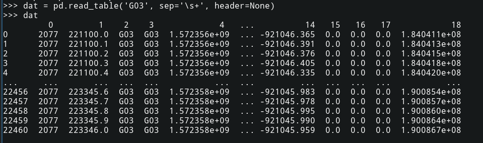

# 1. 读取文件

## 1. 直接使用for循环和列表读取数据


## 2. python数据分析工具pandas

pandas包中的read_table 与R语言中的read.table()有点类似。

```python
pandas.read_table(filepath_or_buffer,sep='\t',delimiter=None,
                  header='infer',names=None,index_col=None,usecols=None,squeeze=False,
                  prefix=None,mangle_dupe_cols=True,dtype=None,engine=None,converters=None,
                  true_values=None,false_values=None,skipinitialspace=False,skiprows=None,
                  nrows=None,na_values=None,keep_default_na=True,na_filter=True,verbose=False,
                  skip_blank_lines=True,parse_dates=False,infer_datetime_format=False,
                  keep_date_col=False,date_parser=None,dayfirst=False,iterator=False,
                  chunksize=None,compression='infer',thousands=None,decimal=b'.',lineterminator=None,
                  quotechar='"',quoting=0,escapechar=None,comment=None,encoding=None,dialect=None,
                  tupleize_cols=None,error_bad_lines=True,warn_bad_lines=True,skipfooter=0,
                  doublequote=True,delim_whitespace=False,low_memory=True,memory_map=False,
                  float_precision=None)
```

其中，三个选项比较常用

- filepath_or_buffer   第一个参数,把文件地址传入即可;
- engine='python'      默认是c引擎解析,如果使用python引擎,可以解析更丰富的内容;
- header='infer'       默认会自动推断数据文件头,如果设置为None则无文件头,为1则第一行是文件头;
- sep='\t'             默认是由tab分割的数据,如果是其他可以另改,比如','
- delim_whiteshape=True 如果数据的间隔是多个空格，sep=' '就会产生错误，读出的数据里有Nan，Specifies whether or not whitespace (e.g. ' ' or '    ') will be used as the sep. Equivalent to setting sep='\s+'. 

read_table 返回一个DataFrame类型

```python
import pandas as pd
dat = pd.read_table(filepath_or_buffer, sep='\s+')
```

然后可以对DataFrame进行操作

有些数据文件的第一行是列名，DataFrame可以直接指定列名来提取数据。
读取文本文件时不用header和names指定表头时，默认第一行为表头。


对于没有表头的数据列，可以为DataFrame手动指定，

```python
Names=['N1','N2','N3','N4']
dat.columns=Names   #当然此处Names的元素个数要与dat的列数相同。
```

也可以使用header=None来指定不要表头，再根据行列的定位来提取一列或者多列

```python
dat.iloc[1:10, [2]] # 选取dat的第1到10行，第2列的全部数据
dat.iloc[1:　, [2]] # 选取dat的第一列的全部数据
```

当使用header=None时，程序自动将各列的列名设置为０,1,2,3,...



- read_csv 从文件，url，文件型对象中加载带分隔符的数据。默认分隔符为逗号
- read_table 从文件，url，文件型对象中加载带分隔符的数据。默认分隔符为制表符（“\t”）
- read_fwf 读取定宽列格式数据（也就是没有分隔符）
- read_cliboard 读取剪切板中的数据，可以看做read_table的剪切板。在将网页转换为表格时很有用

一般来说通过上述两种方法即可获得所需要的数据列，然后可以使用matplotlib来进行绘图

# 2. 绘图

```python
import matplotlib.pyplot as plt #约定俗成的写法plt
```

## 2.1 简单绘图


同时显示多个图形窗口

```python
plt.figure()
```

##　参考连接

- https://blog.csdn.net/daydayup_668819/article/details/82315565
- [pandas官方说明](https://pandas.pydata.org/pandas-docs/stable/reference/api/pandas.read_table.html)
