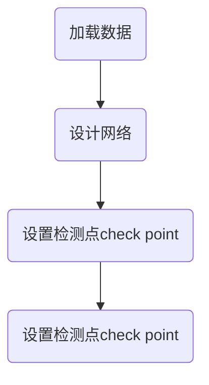

机器学习概述

深度学习框架
1. Tensorflow
	1. 谷歌开发
	2. C++编写
	3. 使用数据流图：图中的节点代表数学运算，线条表示多维数据数组的交互
	4. 架构灵活
	5. 维护更新频繁，使用人数最多
	6. 第三方封装：Keras， Tflearn，tfslim， TensorLayer
3. Torch
	1. pyTorch 的前身
	2. 特别灵活
5. caffe
	1. 对卷积神经网络的支持好
	2. 只提供C++接口，内存占用高
7. Theano
	1. Tensorflow的前身
9. MXNet
	1. 国产框架，李沐
	2. 亚马逊的官方框架，有较好的分布式支持
	3. 性能特别好，占用现存低