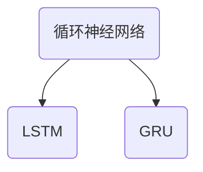

测试

$$E=mc^2$$

## 线性代数

矩阵分解及其编程实现

- [奇异值分解 - 维基百科，自由的百科全书](https://zh.wikipedia.org/wiki/%E5%A5%87%E5%BC%82%E5%80%BC%E5%88%86%E8%A7%A3)
- [Linear algebra (numpy.linalg) — NumPy v1.22.dev0 Manual](https://numpy.org/devdocs/reference/routines.linalg.html)
- [Linear algebra (scipy.linalg) — SciPy v1.7.1 Manual](https://docs.scipy.org/doc/scipy/reference/linalg.html)
- [cholesky/cholesky_serial.c at master · luminosa42/cholesky](https://github.com/luminosa42/cholesky/blob/master/cholesky_serial.c)

## 机器学习算法

## 深度学习算法

| 函数 | 导数 |
|------|------|
| $x^n$ | $nx^{n-1}$ |
| $e^x$ | $e^x$ |
| $\ln x$ | $\frac{1}{x}$ |
| $\sin x$ | $\cos x$ |
| $\cos x$ | $-\sin x$ |