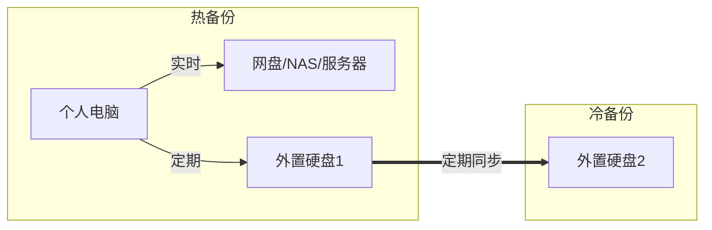

# 如何保存自己的数据

个人用户一般来说只有

## 分析自己的数据需求

通常情况下，想要数据

- 既存储安全，又取用方便
- 既体积巨大，又成本低廉
- 既互联互通，又自主可控

基本上是不可能的。因此我们最好根据自己的数据需求和预算，以及对于潜在风险的可接受程度，来决定自己的数据存储需求。

- 如果是体积很大的数据，比如是TB级的电影，那最好自己买个NAS
- 如果是
- 多重备份，

## 分清同步和备份

有些数据不需要实时同步，比如好久没看的电影、照片等，这些数据最好从同步的队伍中剔除，可以减少需要同步的文件的数量。

只要开着同步就行了么？那你就太傻了。举个例子，对于没有保留文件副本或者修改历史的同步软件，那你就要慎重考虑一下了，

## 慎重选择网络云盘

对于国内有些云盘，采用“**关门打狗**”的运作方式，先打着2T、10T的大容量、永久免费
的旗号，然后等着用户们都入了坑，然后以各种理由要么缩减空间，要么对免费用户进行
降速等一系列劣化免费用户的服务，并看准时机向用户推荐高价套餐。企业为付费客户提
供更加优质的服务无可厚非，向客户展示广告推销自己的优质服务也算常规操作。但某些
国内企业的恶心之处在于，当用户需要将数据转移时，或者急需下载某些数据时，那几十
kb/s以内的速度真是让人抓狂。想要速度，充钱吧，你会变得更强！但是大爷能不能让我
先下了数据再说？？

我更喜欢那些限量不限速的云盘，比如Google Drive, Dropbox, Onedrive以及国内有名的
坚果云。容量可以小点，大容量做不下去可以直说，然后做小容量免费的网盘，比如
Onedrive就从30G缩到5G。坚果云则坚持免费用户每月1G上传流量，但是无论免费用户还是
付费用户，这些厂商都没有进行限速，如果不是国内那些你懂的和你不懂的因素影响，基
本上都能上M/s。

- 如果有梯子就Google Drive, Dropbox, Onedrive随意吧如果没有，windows环境就选
- Onedrive，mac就选iCloud没跑了
- 如果想要版本管理和三大系统都支持，那就选坚果云吧

对于Ms、Apple、Google，只要钱给够，这些大厂肯定把你伺候的舒舒服服。容量无上线，
做事有底线。但是在某些Magic Town，这些大厂的服务就有些打折了。所以看个人需要咯
；

## 自己动手，丰衣足食

当下，消费级的存储设备简直是白菜价，1T机械硬盘也就300-500块；自建NAS和家庭服务
器正在逐渐变得简单和流行。相反、隐私问题频出、勿删用户数据等事件，导致云服务和
云存储对于个人的吸引力正逐渐下降。连最安全的Apple也爆出用户账户被攻破导致的泄密
。其实说到底

> 没有真正意义上的云服务器，那只是别人的计算机。

普通用户可以在简单地把数据在自己设备上的同步，不需要网络。比如说下面这个方案

- 一个移动硬盘或者U盘，大小自己看着办
- 增量同步软件：rsync, freefilesync, goodsync 等

## 良好的数据整理习惯

## 数据备份的3-2-1原则

网络世界永远不是安全的，电脑普及之前，个人用户的私人数据还是比较少的。现在很多
人都靠电脑赚钱养家，Hacker们也无耻地把黑手伸到普通人身上，各种勒索软件、流氓软
件防不甚防。

运用**3-2-1 原则**，可以有效保障个人数据的安全，通过简单的操作步骤，即使不幸遭
遇设备丢失、勒索软件等灾难，也可以从容恢复数据。

- 3：重要文件存储 3 份，一份原件加上两份拷贝。一般来说，本机一份，云空间/服务器/NAS一份，移动硬盘冷备份一份。
- 2：将文件起码同步两种不同的介质上。
- 1：将一份拷贝保存在异地。对于个人用户来说，家里放个备份硬盘，公司/学校放一个，基本上就OK。

## 最后

