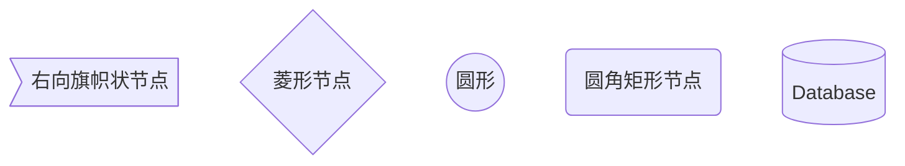
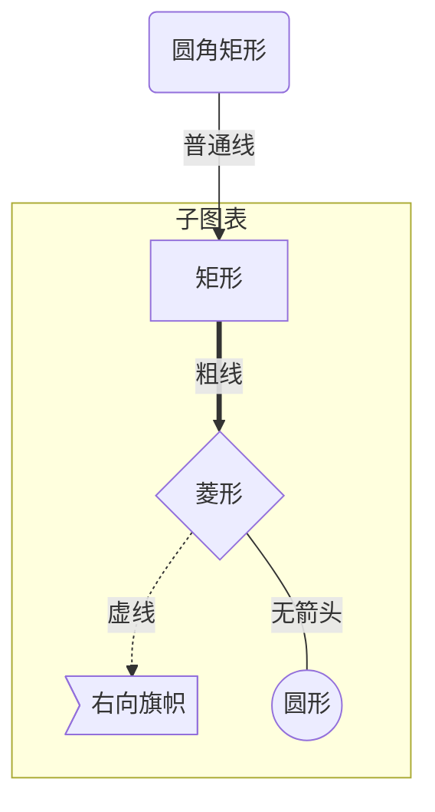
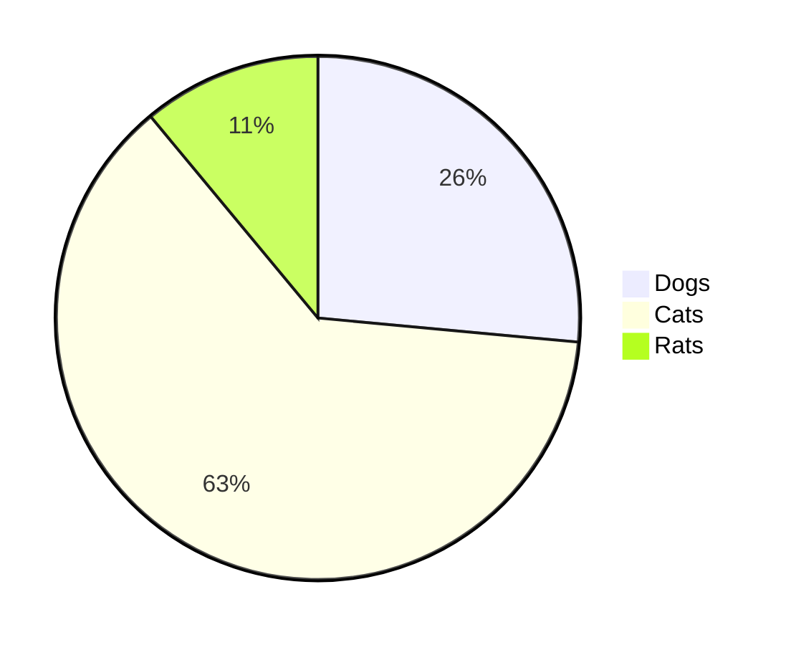

All I know about markdown.

## 在文档中引用函数使用单引号

Use the `printf()` function.


## markdown的默认表格形式

Markdown 制作表格使用 `|` 来分隔不同的单元格，使用 `-` 来分隔表头和其他行。

pandoc以及其他工具支持更多的表格形式，

```
| 表头   | 表头   |
| ------ | ----  |
| 单元格 | 单元格 |
| 单元格 | 单元格 |
```

参考教程

- [Markdown 表格-菜鸟教程](https://www.runoob.com/markdown/md-table.html)

## markdown中的公式

markdown支持数学公式主要是两个JS插件MathJax和KaTeX。

[Supported Functions · KaTeX](https://katex.org/docs/supported.html#line-breaks)

加颜色，加大字体

```latex
$$\color{blue}{F=ma}$$
```

$$E=mc^2$$

$$\color{blue}{F=ma}$$

```latex
$$\huge{F=ma}$$
```

$$\huge{F=ma}$$

```latex
$$\Huge{F=ma}$$
```

$$\Huge{F=ma}$$

## markdown相关软件

浏览器插件

- Copy Selection as Markdown

- Markdown Viewer

    支持的数学公式，mermaid和图表，非常不错。

下面两个插件也不错，但是没有数学公式支持
- Markdown Editor for Firefox
- Markdown Viewer Webext

**QOwnNotes不支持数学公式，忽略之**

[Latex support · Issue #529 · pbek/QOwnNotes](https://github.com/pbek/QOwnNotes/issues/529)

> MathJax is a javascript library, we don't have a webbrowser to use it. Please see [#377](https://github.com/pbek/QOwnNotes/issues/377) and [#400](https://github.com/pbek/QOwnNotes/issues/400).

## Mermaid 实用教程

Mermaid是一个用于画流程图、状态图、时序图、甘特图的库，使用JS进行本地渲染，广泛集成于许多Markdown编辑器中。

之前用过 PlantUML，但是发现这个东西的实现原理是生成 UML 的图片后上传服务端，每次再从服务端读取，因此觉得不够鲁棒，隐私性也不好，因而弃用。

Mermaid 作为一个使用 JS 渲染的库，生成的不是一个“图片”，而是一段 HTML 代码，因此安全许多。

官网：[https://mermaidjs.github.io/](https://mermaidjs.github.io/)

Github 项目地址：[https://github.com/knsv/mermaid](https://github.com/knsv/mermaid)

接下来介绍 Mermaid 的流程图及序列图的语法，也就是大家在工作中常使用的图表。

## 流程图

### 图表方向

Mermaid 支持多种图表的方向，语法如下：

```
graph 方向描述
    图表中的其他语句...
```

其中“方向描述”为

| 用词 | 含义     |
| ---  | ---      |
| TB   | 从上到下 |
| BT   | 从下到上 |
| RL   | 从右到左 |
| LR   | 从左到右 |

## 用语转义

只支持表情，不支持公式？？


### 节点定义

即流程图中每个文本块，包括开始、结束、处理、判断等。Mermaid 中每个节点都有一个 id，以及节点的文字。

| 表述         | 说明           |
| ---          | ---            |
| `id[文字]`   | 矩形节点       |
| `id(文字)`   | 圆角矩形节点   |
| `id((文字))` | 圆形节点       |
| `id>文字]`   | 右向旗帜状节点 |
| `id{文字}`   | 菱形节点       |
| `id[(文字)]` | 数据库节点     |

需要注意的是，如果节点的文字中包含标点符号，需要时用双引号包裹起来。
另外如果希望在文字中使用换行，请使用替换换行



### 节点间的连线

| 表述       | 说明           |
| ---        | ---            |
| `>`        | 添加尾部箭头   |
| `-`        | 不添加尾部箭头 |
| `--`       | 单线           |
| `--text--` | 单线上加文字   |
| `==`       | 粗线           |
| `==text==` | 粗线加文字     |
| `-.-`      | 虚线           |
| `-.text.-` | 虚线加文字     |

### 子图表

使用以下语法添加子图表

```
subgraph 子图表名称
    子图表中的描述语句...
end
```

### 对 fontawesome 的支持

使用 `fa: # 图表名称 #` 的语法添加 fontawesome。

### 举个例子




## 序列图

使用以下语法开始序列图

```
sequenceDiagram
    [参与者1][消息线][参与者2]:消息体
    ...
```

例如

```
sequenceDiagram
    张三->>李四: 吃了吗？
    李四->>张三: 吃了
```

### 参与者

上例中的张三、李四都是参与者，上例中的语法是最简单的，也可以明显表明参与者有哪些

```
sequenceDiagram
    participant 参与者 1
    participant 参与者 2
    ...
    participant 简称 as 参与者 3 # 该语法可以在接下来的描述中使用简称来代替参与者 3
```

### 消息线

| 类型   | 描述                       |
| ----   | ----                       |
| `->`   | 无箭头的实线               |
| `-->`  | 无箭头的虚线               |
| `->>`  | 有箭头的实线               |
| `-->>` | 有箭头的虚线               |
| `-x`   | 末端为叉的实线（表示异步） |
| `--x`  | 末端为叉的虚线（表示异步） |

### 处理中

在消息线末尾增加 `+` ，则消息接收者进入当前消息的“处理中”状态；
在消息线末尾增加 `-` ，则消息接收者离开当前消息的“处理中”状态。

或者使用以下语法直接说明某个参与者进入“处理中”状态

```
activate 参与者
```

### 标注

语法如下

```
Note 位置表述 参与者: 标注文字
```

其中位置表述可以为

| 表述     | 含义                       |
| ---      | ---                        |
| right of | 右侧                       |
| left of  | 左侧                       |
| over     | 在当中，可以横跨多个参与者 |

### 循环

语法如下

```
loop 循环的条件
end
```

### 判断

```
alt 条件 1 描述
    分支 1 描述语句
else 条件 2 描述 # else 分支可选
    分支 2 描述语句
else ...
    ...
end
```

如果遇到可选的情况，即没有 else 分支的情况，使用如下语法：

```
opt 条件描述
    分支描述语句
end
```

### 举个例子


```
sequenceDiagram
    participant z as 张三
    participant l as 李四
    loop 日复一日
        z->>l: 吃了吗您呐？
        l-->>z: 吃了，您呢？
        activate z
        Note left of z: 想了一下
        alt 还没吃
            z-xl: 还没呢，正准备回去吃
        else 已经吃了
            z-xl: 我也吃过了，哈哈
        end
        opt 大过年的
            l-->z: 祝您新年好啊
        end
    end
```


- [Mermaid 实用教程_平头-CSDN博客_mermaid](https://blog.csdn.net/fenghuizhidao/article/details/79440583)
- [mermaid官方教程](https://mermaid-js.github.io/mermaid/#/README)

### mermaid绘制饼图



## 添加脚注

使用 Markdown[^1]可以效率的书写文档, 直接转换成 HTML[^2], 你可以使用 Typora[^T] 编辑器进行书写。

[^1]:Markdown是一种纯文本标记语言
[^2]:HyperText Markup Language 超文本标记语言
[^T]:NEW WAY TO READ & WRITE MARKDOWN.


## markdown软件的选择理由

1. logseq : 存储的格式不是标准的markdown格式。
2. obsidian: 使用起来太过复杂，同步功能比较弱，但预览的确很强