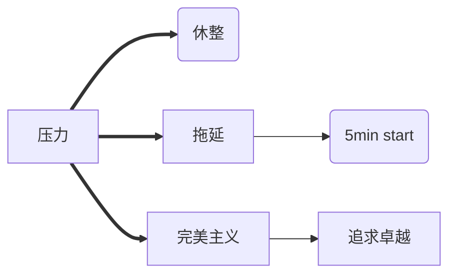

[【哈佛大学公开课】幸福课（积极心理学）【心理学】_哔哩哔哩_bilibili](https://www.bilibili.com/video/BV1kx411S7ZU?p=14)

**人不是机器。**

机器与人的不同在于，机器感受不到压力，并且不需要休息。人不仅可以感受到压力，各种各样的压力，并且某些压力是这个物种独有的。

压力本身不是问题，而是缺乏休整的压力。在压力下进行运动，在休息中恢复精力，不仅不会造成危害，反而使运动员变得更强，如此循环往复，这样运动员的能力得到发展。无休止的劳动，持续的运作，只会让人产生持续的压力。得不到休整的情况下，压力就会变成焦虑、抑郁。违反人的天性，只能导致人的毁灭。

**人需要休整，并且需要专注地休息。**

我们不仅要专注于工作，而且要专注于休息。休息是转移注意力，不是分散注意力。课程里面提到，听一首喜欢的歌是休息，同时听两首喜欢的歌就是折磨了。如果在陪伴孩子的时候，一边做家务或者打电话，那么妈妈也会觉得这段时间"有意义但不愉悦"。分心，让可能更加美好的时刻，大打折扣。这是对人生的巨大浪费，而且这是我们应该可以避免的。

现代社会有越来越多的产品在掠夺你的注意力，凡是以用户使用时长为标准的软件，都属于此类。这些产品则是由人们当中最懂得专注的人制造的，很难说这不是一种讽刺。但是，我的精力是稀缺的，我的注意力是稀缺的。我应当捍卫和使用我自身的这种宝贵的能力。

专注意味着说不，对更多的事情说不，宁缺毋滥，留下你最想要做的事情并投入到其中去。哪怕是休息，选择你最喜欢的一件事情去做。这本身就是提升我们生活质量最简单的方式。

**先做5分钟**

我们对失败的恐惧，对完美的幻想，往往比事实能产生更多的压力，并且导致拖延。往往我们拖延的借口是，要有所行动，必须受到激励，必须等外界满足某种条件。"如果...，我就开始..."。要是XXX就好了，我就去写作业。但真相是，要先开始行动，只要我们开始行动，态度会随之发生改变。行动会改变现状，得到新的反馈，让我们有继续下去的惯性。

因此，克服拖延，最重要的办法是先开始5分析（5 min start）。不讲任何借口，任何理由地开始做那件你想拖延的事情，并坚持5分钟。

**害怕失败的完美主义是一种病态的幻想**

完美是一种剧毒的幻想。从来不存在完美的人，除了在人的病态幻想当中。

我们为了满足这种幻想，不把领袖当人看，一定要将他们宣传成完美的圣人。选择性无视他们的缺点，鼓吹他们的优点，并且打压一切敢于提出异议的他人。但他们的缺点却不会因为我们的幻想和掩盖而消失，其危害反倒因我们的盲目得以放大。

> 做了人类想成仙,生在地上要上天。鲁迅

有些人把这种病态的幻想投射到自己能够掌控的人身上，比如针对自己的孩子。总是让孩子替自己争光，去考最好的成绩，最好的大学，最好的工作。但是他们对最好一无所知，唯一指标就是与别人的攀比当中获胜。

更多的人，比如我，恐惧失败，在潜意识里希望自己完美而不会犯错，其实这是最大的虚妄。害怕失败的完美主义，让失败比它本身看起来可怕千倍万倍。

我们要抛弃这种幻想，“不是让他放弃志向，或者停止努力工作，也不是消除失败时的痛苦。这是不可避免的，而是获得一种更理性，更有益，更可控的处理失败的方法。”

课程中号召我们“从完美主义转为追求卓越(the pursuit of excellence)”。追求卓越不是变得完美，是追求变好。不是追求变得最好，而是追求变得更好。认清并接受自己的现实情况，然后再次基础上不断尝试变得更好，才会在成长的过程中享受快乐，而不是在焦虑当中惶惶不可终日。

