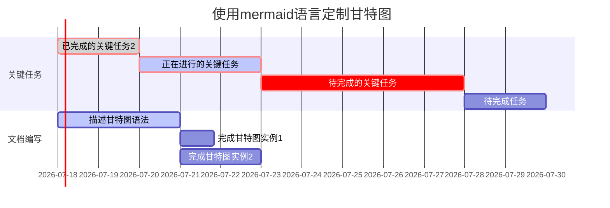

## 绘制gantt图

[markdown的流程图、时序图、甘特图画法 - 简书](https://www.jianshu.com/p/a9ff5a9cdb25)

[markdown 绘制流程图、时序图、甘特图 - 简书](https://www.jianshu.com/p/6dbcc3aff98b)

[Markdown语法（高级） - 作业部落 Cmd Markdown 编辑阅读器](https://www.zybuluo.com/zhangzexiang/note/802980#9-%E7%94%98%E7%89%B9%E5%9B%BE)

[甘特图和项目管理的区别是什么？ - 知乎](https://www.zhihu.com/question/419128160)

[Gantt](https://mermaid-js.github.io/mermaid/#/gantt)
