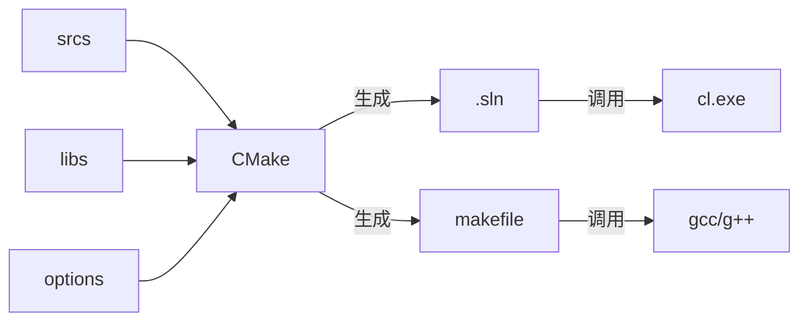

## 1. 软件构建

代码开发的过程当中，最简单的情况，就是将同一个程序需要的所有资源（源文件，动态/静态链接库，头文件等等），放在同一个文件夹，然后在这个文件夹中编译，生成一个独立的exe。但这种情况只适合最简单的编程情况，比如验证某个技术问题，计算一些简单的内容。

如果我们想对某个多文件、多依赖、多目标的项目进行管理，则必须进行软件构建。

**软件构建Build**是将源文件、依赖库和相关资源转换为可执行文件或其他产物（库文件、安装包、容器等）的过程。

软件构建过程分为5个步骤 

1. 编译
2. 链接
3. 打包
4. 测试
5. 发布

具体可以参考[浅谈软件开发中的构建_软件构建-CSDN博客](https://blog.csdn.net/qq_46452924/article/details/144831478)

但是，这些官话太正式了，与实际我觉得软件构建主要有以下内容

1. 确定构建目标。构建的目标是什么？是生成一个exe，还是生成一个链接库？
2. 确定构建依赖。为了完成构建目标，此次构建需要什么？
    - 对应的源文件，文件的位置，文件的类型
    - 编译器
    - 编译选项（Debug/Release，预编译选项等）
    - 依赖的链接库，库的名称，库的位置。这些库需不需要重新构建等等
    - 依赖的资源（一般是些图片、文本文件等内容）
3. 确定构建的目录
    - 构建中的临时文件位置
    - 构建生成的目标文件位置

不管我们是用IDE，或者make、ninja、CMake 等命令行工具，一般都需要在相应的软件中，**找到如上内容的设置选项**。你可以不懂原理，但一定要学会相应的设置

## 2. 自动化软件构建工具

IDE一般将构建与编写完全集成在一起。比如我们用VS建立一个新的项目 ConsoleApplication1。可以得到如下的文件

```
ConsoleApplication1.sln
ConsoleApplication1.cpp
ConsoleApplication1.vcxproj
ConsoleApplication1.vcxproj.filters
ConsoleApplication1.vcxproj.user
```

除了`ConsoleApplication1.cpp`，剩余的文件都VS的项目文件。构建相关的所有配置都存在这些文件当中。VS的界面更改相关设置之后，设置内容立即生效。但退出VS时，更改的设置才会保存到项目文件当中。

此外，上述VS的项目文件都是文本文件（xml语言）。用户也可以通过文本编辑器进行手动编辑。其他的IDE，诸如qtcreator，codeblocks，Eclipse都是同样的设计思路，只是项目文件的格式不同

另一种自动化构建工具，则是专门的构建程序，如make、ninja，nmake。它们的共同特点是，读取一个配置文件，然后根据其中的设置，对指定的代码进行编译。

由于编程语言的发展，各个平台上的各种IDE、自动化构建工具简直是太多了。在跨平台、跨系统开发的过程当中，项目可能需要不断地切换编译软件，并且更改相关配置。为了解决这个问题，CMake 应运而生。

CMake 并不直接进行构建，只是为各种构建系统生成对应的构建文件。然后由相应的构建软件启动对应的编译器进行编译工作。



## 3. 总结

