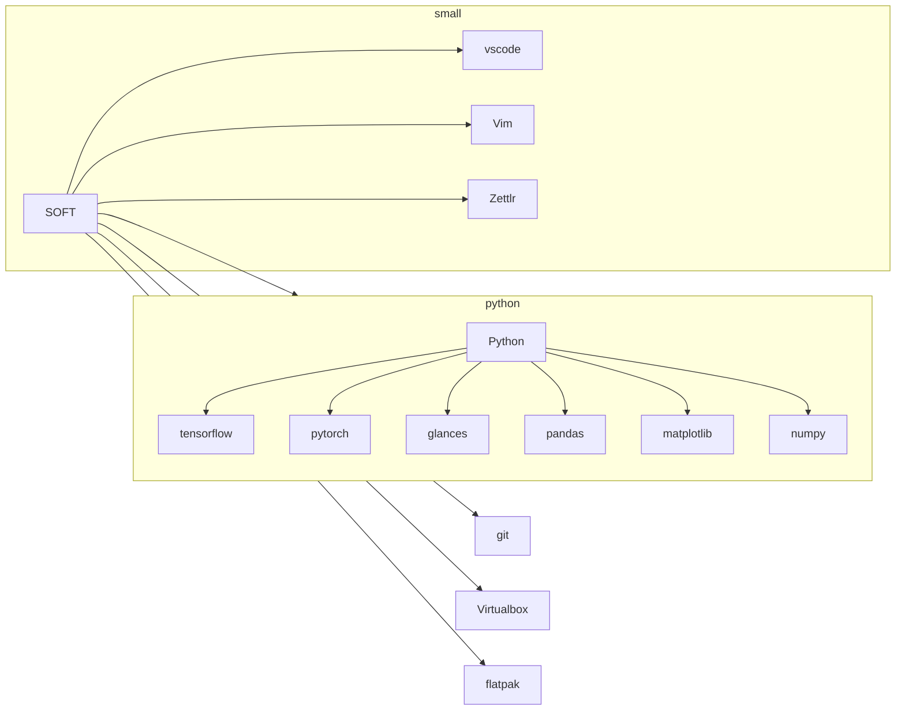

```mermaid
graph LR

    SOFT -->  git
    SOFT -->  python

    subgraph python
        Python --> tensorflow
        Python --> pytorch
        Python --> glances
        Python --> pandas
        Python --> matplotlib
        Python --> numpy
    end


    SOFT   --> Virtualbox

    SOFT   --> flatpak

    subgraph small
        SOFT  --> vscode
        SOFT  --> Vim
        SOFT  --> Zettlr
    end
```

flatpak --> fdelete("delete config `rm -rf ~/.var/app/`")
