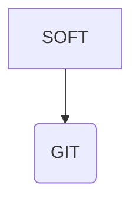

## 01. vim的基本操作



syntax on：这可以确保 Vim 知道我在使用什么语法。做笔记、写这种文章时我主要使用 Markdown； 而在写小说的时候，纯文本是我的首选格式。
set noerrorbells：为了你的精神状态，我强烈建议打开这个选项。
set textwidth=100：为了便于阅读，没有人愿意横向滚动一个文本文件。
set spell：如果有拼写错误的话提醒你。
set wrap：确保文本以写作者而不是程序员的方式进行折行。
你会注意到，我没有花更多时间讨论其他一些基本配置选项，因为我并不觉得那些对写作者来说有多重要。因为我做一些业余的编码工作，所以我的.vimrc配置反映了这一点。如果你只想在Vim上写作，那么上述配置就应该能让你顺利开始。

从这点上来说，你的 .vimrc 是一个活的文档，它能生动地反映你想用 Vim 做什么，以及你希望 Vim 如何为你做这些事情。

```vim
syntax on
set noerrorbells " 取消 Vim 的错误警告铃声，关闭它以免打扰到我们 "
set textwidth=100 " 确保每一行不超过 100 字符 "
set tabstop=4 softtabstop=4
set shiftwidth=4
set expandtab
set smartindent
set linebreak
set number
set showmatch
set showbreak=+++
set smartcase
set noswapfile
set undodir=~/.vim/undodir
set undofile
set incsearch
set spell
set showmatch
set confirm
set ruler
set autochdir
set autowriteall
set undolevels=1000
set backspace=indent,eol,start
" 下面的设置确保按写作者而不是程序员喜欢的方式折行 "
set wrap
nnoremap <F5> :set linebreak<CR>
nnoremap <C-F5> :set nolinebreak<CR>
call plug#begin('~/.vim/plugged')
"   这是颜色风格插件 "
Plug 'colepeters/spacemacs-theme.vim'
Plug 'sainnhe/gruvbox-material'
Plug 'phanviet/vim-monokai-pro'
Plug 'flazz/vim-colorschemes'
Plug 'chriskempson/base16-vim'
Plug 'gruvbox-community/gruvbox'
"   这是为了更容易的诗歌写作选择的一些插件 "
Plug 'dpelle/vim-LanguageTool'
Plug 'ron89/thesaurus_query.vim'
Plug 'junegunn/goyo.vim'
Plug 'junegunn/limelight.vim'
Plug 'reedes/vim-pencil'
Plug 'reedes/vim-wordy'
"   这一部分是为了更容易地与机器集成，用了 vim-airline 这类插件 "
Plug 'vim-airline/vim-airline'
"   这一部分外理工作区和会话管理 "
Plug 'thaerkh/vim-workspace'
"   与上面插件相关, 下面的代码将你的所有的会话文件保存到一个你工作区之外的目录 "
let g:workspace_session_directory = $HOME . '/.vim/sessions/'
"   与上面插件相关，这是一个 Vim 活动的跟踪器 "
Plug 'wakatime/vim-wakatime'
"   一个干扰因素：我在这里使用了一些 Emacs 的功能，特别是 org-mode "
Plug 'jceb/vim-orgmode'
"  这是文件格式相关插件 "
Plug 'plasticboy/vim-markdown'
call plug#end()
colorscheme pacific
set background=dark
if executable('rg')
    let g:rg_derive_root='true'
endif
```


vim删除文件中的所有空格

```vim
：v/./d
```

### Vim 范围选择

使用 Vim，你可以轻松地对文件中的一系列行执行操作。你可以通过起始行号、逗号和结束行号（包括）来指示范围。除了文字行号之外，你还可以使用句点（`.`）表示当前行，使用美元符号 （`$`） 表示文件缓冲区中的最后一行，以及使用百分号（`%`）表示整个文件。

这里举几个例子来说明。

 - `:2,10d` 删除第 2 到 10 行
- `:25,$d` 删除从第 25 行到文件末尾的每一行：

你可以使用以下命令删除每一行： `:%d`

要将第 5 到 10 行复制（或转移）到第 15 行之后：

1. `:5,10t 15`

要将第 5 行到第 10 行移动到第 15 行之后（而不是复制）：

1. `:5,10m 15`

## vim diff 对比文件


```
vimdiff  file_left  file_right 或者  vim -d  file\_left  file\_right
```

方式二

vim file\_left

```
vertical diffsplit file_right
```

2. 在差异点跳转

    - 向下跳转：]c
    - 向上跳转：[c
    - 跳转到更远的差异点: 3]c

3. 文件合并

    - 将当前文件内容合并到另一边：dp  (diff "put")
    - 将另一边内容合并到当前行：do  (diff "obtain")
    - 手动刷新比较结果： :diffupdate

4. 窗口移动

    - Ctrl-w K（把当前窗口移到最上边）
    - Ctrl-w H（把当前窗口移到最左边）
    - Ctrl-w J（把当前窗口移到最下边）
    - Ctrl-w L（把当前窗口移到最右边）


