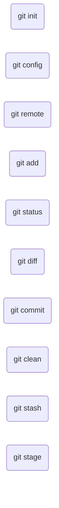
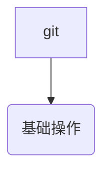

git status中文乱码

linux下git默认对于中文的支持不是很好，比较突出的就是git status显示的中文文件名
全是“\344\272\247\345\223\201\351\234\200\346\261\202”之类的代码

解决这个问题方法是：

```bash
git config --global core.quotepath false
```

-------------------------------

如何下载Github上某个库的分支

以rtklib为例

```bash
git clone https://github.com/tomojitakasu/RTKLIB.git --depth=1 -b rtklib_2.4.3
```

------------------------------------------

删除未跟踪的文件和文件夹 git clean

```bash
git clean -f # 删除未跟踪的文件
git clean -d # 删除未跟踪的文件夹
git clean -n # 在删除前提示删除那些文件
git clean -dnf
```

-------------------------------------

git remote

```bash
git remote -v 显示远程仓库地址
```

----------------------------------------------------

git stage 与git add 有什么区别


-------------------------------------------------
git 如何提交文件的一部分


```bash
git add --patch/-p <filename>
```

git会把所指定的文件的修改部分划分为一个个hunk，然后逐个提问块的处理方式

```
Stage this hunk [y,n,q,a,d,/,j,J,g,s,e,?]?
```

另一种方式

```bash
git add -e
```
-------------------------------------------------------------

警告与错误

1. warning: LF will be replaced by CRLF in XXXXXXXXXXXXXX.

在repo文件目录下执行

```bash
git config core.autocrlf false
```


git更改远程仓库地址

1、切换远程仓库地址：  
方式一：修改远程仓库地址

```bash
git remote set-url origin URL   #更换远程仓库地址，URL为新地址。
```

方式二：先删除远程仓库地址，然后再添加

```bash
git remote rm origin # 删除现有远程仓库  
git remote add origin url # 添加新远程仓库
```

2、git remote -v 查看远程仓库的地址





## git的错误提示

### github网络连接问题

[git - GnuTLS recv error (-110): The TLS connection was non-properly terminated - Stack Overflow](https://stackoverflow.com/questions/52529639/gnutls-recv-error-110-the-tls-connection-was-non-properly-terminated)

[git - GitHub - failed to connect to github 443 windows/ Failed to connect to gitHub - No Error - Stack Overflow](https://stackoverflow.com/questions/18356502/github-failed-to-connect-to-github-443-windows-failed-to-connect-to-github)

Save this answer.
[](https://stackoverflow.com/posts/29300096/timeline)

Show activity on this post.

`ipconfig /renew`

[shell - Github error: Failed to connect to 443 port - Stack Overflow](https://stackoverflow.com/questions/34021288/github-error-failed-to-connect-to-443-port)


## git commit 

Git 每次提交必须尽量独立、且目标明确。因此必须小而美，会产生大量的提交。
如果你想从成百上千条commit信息中找到特定的提交，必须对commit信息进行规范化。

1. 标题

```js
[<type>](<scope>) <subject> (#pr)
```

- 提交类型 Type

- feature
- fix 
- perf
- refactor
- test 
- build
- style
- merge
- docs
- data
