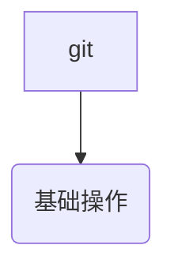

## git的错误提示

### github网络连接问题

[git - GnuTLS recv error (-110): The TLS connection was non-properly terminated - Stack Overflow](https://stackoverflow.com/questions/52529639/gnutls-recv-error-110-the-tls-connection-was-non-properly-terminated)

[git - GitHub - failed to connect to github 443 windows/ Failed to connect to gitHub - No Error - Stack Overflow](https://stackoverflow.com/questions/18356502/github-failed-to-connect-to-github-443-windows-failed-to-connect-to-github)

Save this answer.

Show activity on this post.

`ipconfig /renew`

[shell - Github error: Failed to connect to 443 port - Stack Overflow](https://stackoverflow.com/questions/34021288/github-error-failed-to-connect-to-443-port)
