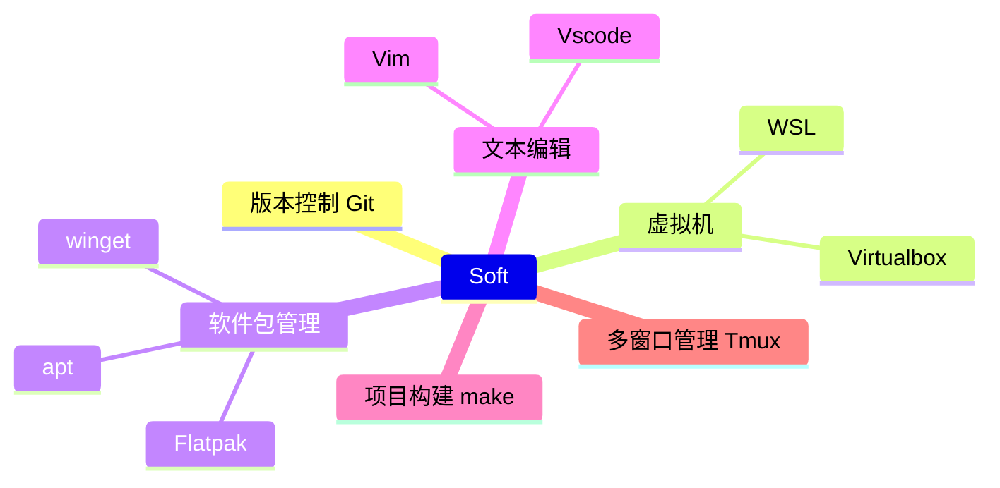
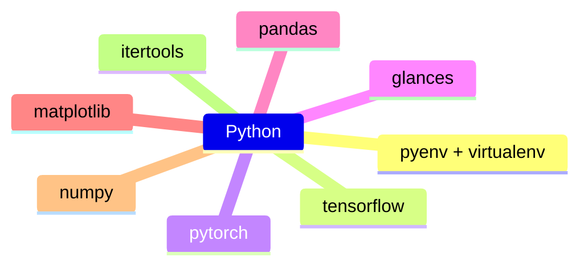

```mermaid
mindmap
    Soft
        版本控制 Git
        虚拟机
            WSL
            Virtualbox
        软件包管理
            apt
            Flatpak
            winget
        文本编辑
            Vscode
            Vim
        项目构建 make
        多窗口管理 Tmux

```

### 常用的python库

```mermaid
mindmap
    Python
        pyenv + virtualenv
        tensorflow
        pytorch
        glances
        pandas
        matplotlib
        numpy
        itertools
```

flatpak --> fdelete("delete config `rm -rf ~/.var/app/`")

### 其他的软件

```mermaid
mindmap 
    其他软件 
        Firefox
```

