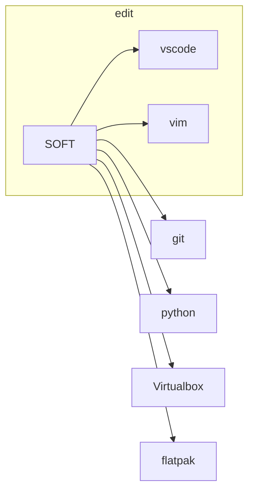
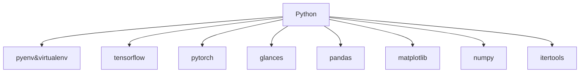
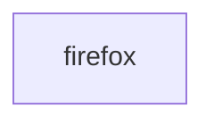

```mermaid
graph LR

    SOFT -->  git
    SOFT -->  python

    SOFT   --> Virtualbox

    SOFT   --> flatpak

    subgraph edit
        SOFT  --> vscode
        SOFT  --> vim
    end
```

### 常用的python库

```mermaid
graph TD
    Python --> pyenv&virtualenv
    Python --> tensorflow
    Python --> pytorch
    Python --> glances
    Python --> pandas
    Python --> matplotlib
    Python --> numpy
    Python --> itertools
```

flatpak --> fdelete("delete config `rm -rf ~/.var/app/`")

### 其他的软件

```mermaid
graph TD
    firefox

```

